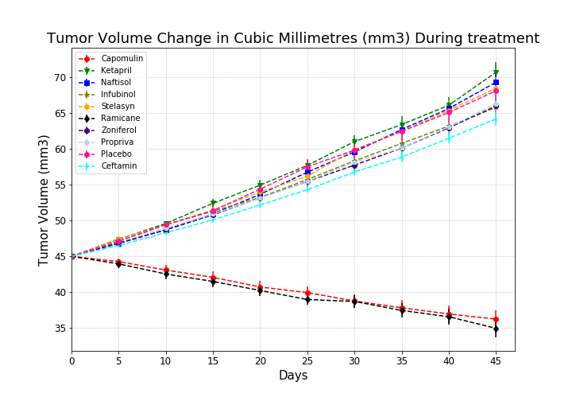
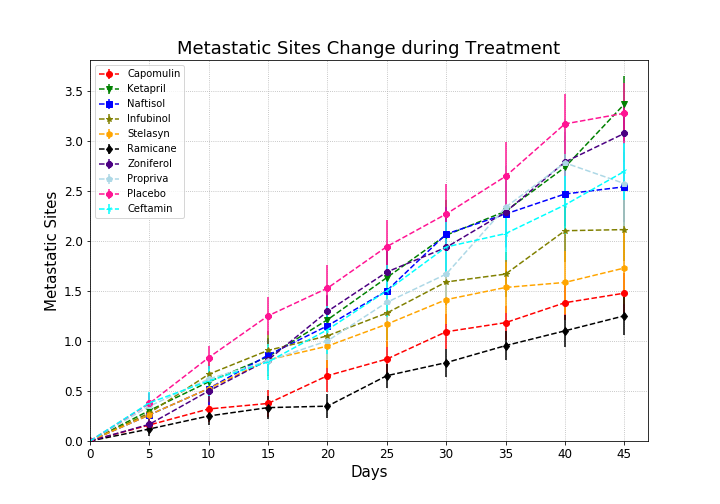
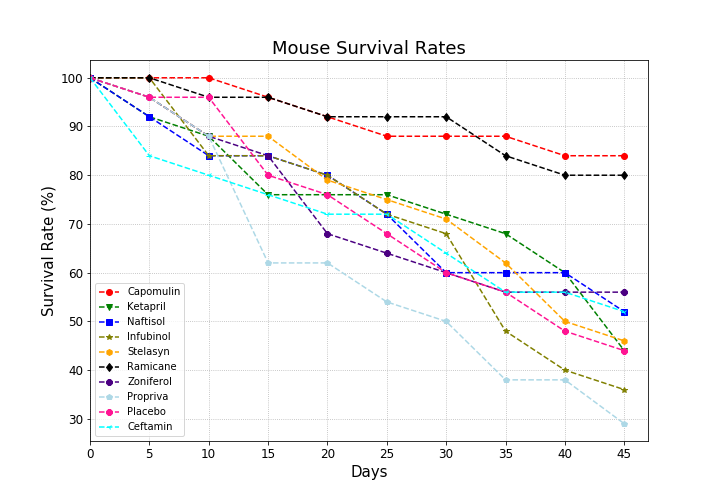
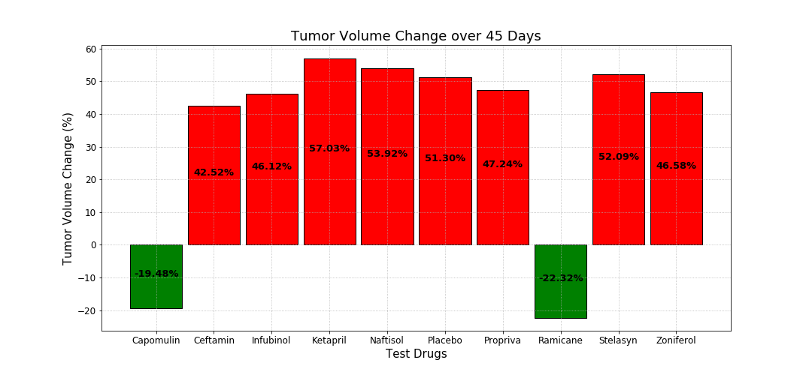

Observable Trends:

- Ramicane and Capomulin appear to be the most effective drugs with the greatest decrease in tumor volume over the course of the study
- Ketapril and Naftisol appear to be the least effective drugs with the greatest increase in tumor volume over the course of the study
-  Ceftamin's survival rate is the lowest despite having one of the lower tumor volume increases

```python
# import dependencies
import pandas as pd
import numpy as np
import matplotlib.pyplot as plt
import os
```


```python
# define file locations
clin_trial_file = os.path.join('raw_data', 'clinicaltrial_data.csv')
mouse_drug_file = os.path.join('raw_data', 'mouse_drug_data.csv')
```


```python
# create clinincal trial dataframe
clin_trial_df = pd.read_csv(clin_trial_file)
clin_trial_df.head()
```


<div>
<style>
    .dataframe thead tr:only-child th {
        text-align: right;
    }

    .dataframe thead th {
        text-align: left;
    }

    .dataframe tbody tr th {
        vertical-align: top;
    }
</style>
<table border="1" class="dataframe">
  <thead>
    <tr style="text-align: right;">
      <th></th>
      <th>Mouse ID</th>
      <th>Timepoint</th>
      <th>Tumor Volume (mm3)</th>
      <th>Metastatic Sites</th>
    </tr>
  </thead>
  <tbody>
    <tr>
      <th>0</th>
      <td>b128</td>
      <td>0</td>
      <td>45.0</td>
      <td>0</td>
    </tr>
    <tr>
      <th>1</th>
      <td>f932</td>
      <td>0</td>
      <td>45.0</td>
      <td>0</td>
    </tr>
    <tr>
      <th>2</th>
      <td>g107</td>
      <td>0</td>
      <td>45.0</td>
      <td>0</td>
    </tr>
    <tr>
      <th>3</th>
      <td>a457</td>
      <td>0</td>
      <td>45.0</td>
      <td>0</td>
    </tr>
    <tr>
      <th>4</th>
      <td>c819</td>
      <td>0</td>
      <td>45.0</td>
      <td>0</td>
    </tr>
  </tbody>
</table>
</div>


```python
# create mouse drug dataframe
mouse_drug_df = pd.read_csv(mouse_drug_file)

# remove mouse ID 'g989'. listed with 2 times with different drugs
mouse_drug_df = mouse_drug_df.drop_duplicates('Mouse ID', keep=False)
```


```python
# merge mouse drug and clin trail dataframes
merged_df = pd.merge(clin_trial_df, mouse_drug_df, on='Mouse ID')
merged_df.head()
```


<div>
<style>
    .dataframe thead tr:only-child th {
        text-align: right;
    }

    .dataframe thead th {
        text-align: left;
    }

    .dataframe tbody tr th {
        vertical-align: top;
    }
</style>
<table border="1" class="dataframe">
  <thead>
    <tr style="text-align: right;">
      <th></th>
      <th>Mouse ID</th>
      <th>Timepoint</th>
      <th>Tumor Volume (mm3)</th>
      <th>Metastatic Sites</th>
      <th>Drug</th>
    </tr>
  </thead>
  <tbody>
    <tr>
      <th>0</th>
      <td>b128</td>
      <td>0</td>
      <td>45.000000</td>
      <td>0</td>
      <td>Capomulin</td>
    </tr>
    <tr>
      <th>1</th>
      <td>b128</td>
      <td>5</td>
      <td>45.651331</td>
      <td>0</td>
      <td>Capomulin</td>
    </tr>
    <tr>
      <th>2</th>
      <td>b128</td>
      <td>10</td>
      <td>43.270852</td>
      <td>0</td>
      <td>Capomulin</td>
    </tr>
    <tr>
      <th>3</th>
      <td>b128</td>
      <td>15</td>
      <td>43.784893</td>
      <td>0</td>
      <td>Capomulin</td>
    </tr>
    <tr>
      <th>4</th>
      <td>b128</td>
      <td>20</td>
      <td>42.731552</td>
      <td>0</td>
      <td>Capomulin</td>
    </tr>
  </tbody>
</table>
</div>


```python
# group merged df by Drug and Timepoint
grouped_df = merged_df.groupby(['Drug','Timepoint'])
```


```python
# find mean of tumor volumes by timepoint for each drug
tumor_vol_means = grouped_df['Tumor Volume (mm3)'].mean()
tumor_vol_means = tumor_vol_means.reset_index(drop=False)
tumor_vol_means = tumor_vol_means.pivot(index='Timepoint', columns='Drug', values='Tumor Volume (mm3)')
tumor_vol_means.head()
```


<div>
<style>
    .dataframe thead tr:only-child th {
        text-align: right;
    }

    .dataframe thead th {
        text-align: left;
    }

    .dataframe tbody tr th {
        vertical-align: top;
    }
</style>
<table border="1" class="dataframe">
  <thead>
    <tr style="text-align: right;">
      <th>Drug</th>
      <th>Capomulin</th>
      <th>Ceftamin</th>
      <th>Infubinol</th>
      <th>Ketapril</th>
      <th>Naftisol</th>
      <th>Placebo</th>
      <th>Propriva</th>
      <th>Ramicane</th>
      <th>Stelasyn</th>
      <th>Zoniferol</th>
    </tr>
    <tr>
      <th>Timepoint</th>
      <th></th>
      <th></th>
      <th></th>
      <th></th>
      <th></th>
      <th></th>
      <th></th>
      <th></th>
      <th></th>
      <th></th>
    </tr>
  </thead>
  <tbody>
    <tr>
      <th>0</th>
      <td>45.000000</td>
      <td>45.000000</td>
      <td>45.000000</td>
      <td>45.000000</td>
      <td>45.000000</td>
      <td>45.000000</td>
      <td>45.000000</td>
      <td>45.000000</td>
      <td>45.000000</td>
      <td>45.000000</td>
    </tr>
    <tr>
      <th>5</th>
      <td>44.266086</td>
      <td>46.503051</td>
      <td>47.062001</td>
      <td>47.389175</td>
      <td>46.796098</td>
      <td>47.125589</td>
      <td>47.168130</td>
      <td>43.944859</td>
      <td>47.470830</td>
      <td>46.851818</td>
    </tr>
    <tr>
      <th>10</th>
      <td>43.084291</td>
      <td>48.285125</td>
      <td>49.403909</td>
      <td>49.582269</td>
      <td>48.694210</td>
      <td>49.423329</td>
      <td>48.938560</td>
      <td>42.531957</td>
      <td>49.335368</td>
      <td>48.689881</td>
    </tr>
    <tr>
      <th>15</th>
      <td>42.064317</td>
      <td>50.094055</td>
      <td>51.296397</td>
      <td>52.399974</td>
      <td>50.933018</td>
      <td>51.359742</td>
      <td>50.891769</td>
      <td>41.495061</td>
      <td>51.448025</td>
      <td>50.779059</td>
    </tr>
    <tr>
      <th>20</th>
      <td>40.716325</td>
      <td>52.157049</td>
      <td>53.197691</td>
      <td>54.920935</td>
      <td>53.644087</td>
      <td>54.364417</td>
      <td>53.127384</td>
      <td>40.238325</td>
      <td>53.970080</td>
      <td>53.170334</td>
    </tr>
  </tbody>
</table>
</div>


```python
# find std error of tumor volumes by timepoint for each drug
tv_std_error = grouped_df['Tumor Volume (mm3)'].sem()
tv_std_error = tv_std_error.reset_index(drop=False)
tv_std_error = tv_std_error.pivot(index='Timepoint', columns='Drug', values='Tumor Volume (mm3)')
tv_std_error.head()
```


<div>
<style>
    .dataframe thead tr:only-child th {
        text-align: right;
    }

    .dataframe thead th {
        text-align: left;
    }

    .dataframe tbody tr th {
        vertical-align: top;
    }
</style>
<table border="1" class="dataframe">
  <thead>
    <tr style="text-align: right;">
      <th>Drug</th>
      <th>Capomulin</th>
      <th>Ceftamin</th>
      <th>Infubinol</th>
      <th>Ketapril</th>
      <th>Naftisol</th>
      <th>Placebo</th>
      <th>Propriva</th>
      <th>Ramicane</th>
      <th>Stelasyn</th>
      <th>Zoniferol</th>
    </tr>
    <tr>
      <th>Timepoint</th>
      <th></th>
      <th></th>
      <th></th>
      <th></th>
      <th></th>
      <th></th>
      <th></th>
      <th></th>
      <th></th>
      <th></th>
    </tr>
  </thead>
  <tbody>
    <tr>
      <th>0</th>
      <td>0.000000</td>
      <td>0.000000</td>
      <td>0.000000</td>
      <td>0.000000</td>
      <td>0.000000</td>
      <td>0.000000</td>
      <td>0.000000</td>
      <td>0.000000</td>
      <td>0.000000</td>
      <td>0.000000</td>
    </tr>
    <tr>
      <th>5</th>
      <td>0.448593</td>
      <td>0.164505</td>
      <td>0.235102</td>
      <td>0.264819</td>
      <td>0.202385</td>
      <td>0.218091</td>
      <td>0.241842</td>
      <td>0.482955</td>
      <td>0.254830</td>
      <td>0.188950</td>
    </tr>
    <tr>
      <th>10</th>
      <td>0.702684</td>
      <td>0.236144</td>
      <td>0.282346</td>
      <td>0.357421</td>
      <td>0.319415</td>
      <td>0.402064</td>
      <td>0.388701</td>
      <td>0.720225</td>
      <td>0.461474</td>
      <td>0.263949</td>
    </tr>
    <tr>
      <th>15</th>
      <td>0.838617</td>
      <td>0.332053</td>
      <td>0.357705</td>
      <td>0.580268</td>
      <td>0.444378</td>
      <td>0.614461</td>
      <td>0.502024</td>
      <td>0.770432</td>
      <td>0.532904</td>
      <td>0.370544</td>
    </tr>
    <tr>
      <th>20</th>
      <td>0.909731</td>
      <td>0.359482</td>
      <td>0.476210</td>
      <td>0.726484</td>
      <td>0.595260</td>
      <td>0.839609</td>
      <td>0.607412</td>
      <td>0.786199</td>
      <td>0.684670</td>
      <td>0.533182</td>
    </tr>
  </tbody>
</table>
</div>


```python
# prepare formating elements for plot
# store time points
timepoints = merged_df['Timepoint'].unique()

# store test drugs
test_drugs = merged_df['Drug'].unique()

# store colors
colors = ['red', 'green', 'blue', 'olive', 'orange', 'black', 'indigo', 'lightblue', 'deeppink', 'cyan']

# store colors
markers = ['o', 'v', 's', '*', 'h', 'd', '8', 'p', '8', '3']
```


```python
# plot tumor volume change on scatter plot
# zip plot format lists together
vol_change_plot_fmt = zip(test_drugs, colors, markers)

# adjust size of plot
fig = plt.figure(figsize=(10, 7))

for drug, color, marker in vol_change_plot_fmt:
    
    # get y values from tumor_vol_means df
    y_values = tumor_vol_means.loc[:, drug]
    
    # get standard error values from tv_std_error df
    standard_error = tv_std_error.loc[:, drug]
    
    # plot in errorbar plot
    plt.errorbar(timepoints, y_values, standard_error,
                 linestyle='--', marker=marker,
                 color=color, label=drug)

# add grid to plot
plt.grid(linestyle='dotted')

# adjust x ticks on plot
plt.xticks(timepoints)

# adjust x axis limit
plt.xlim(0, 47)

# add legend
plt.legend()

# change fontsize of x and y ticks
plt.xticks(fontsize=12)
plt.yticks(fontsize=12)

# add title and axis labels
plt.title('Tumor Volume Change in Cubic Millimetres (mm3) During treatment', fontsize=18)
plt.xlabel('Days', fontsize=15)
plt.ylabel('Tumor Volume (mm3)', fontsize=15)

plt.savefig('plots/Tumor_Volume_Change.png')
plt.show()
```





```python
# find mean of Metastatic Sites by timepoint for each drug
met_site_means = grouped_df['Metastatic Sites'].mean()
met_site_means = met_site_means.reset_index(drop=False)
met_site_means = met_site_means.pivot(index='Timepoint', columns='Drug', values='Metastatic Sites')
met_site_means.head()
```


<div>
<style>
    .dataframe thead tr:only-child th {
        text-align: right;
    }

    .dataframe thead th {
        text-align: left;
    }

    .dataframe tbody tr th {
        vertical-align: top;
    }
</style>
<table border="1" class="dataframe">
  <thead>
    <tr style="text-align: right;">
      <th>Drug</th>
      <th>Capomulin</th>
      <th>Ceftamin</th>
      <th>Infubinol</th>
      <th>Ketapril</th>
      <th>Naftisol</th>
      <th>Placebo</th>
      <th>Propriva</th>
      <th>Ramicane</th>
      <th>Stelasyn</th>
      <th>Zoniferol</th>
    </tr>
    <tr>
      <th>Timepoint</th>
      <th></th>
      <th></th>
      <th></th>
      <th></th>
      <th></th>
      <th></th>
      <th></th>
      <th></th>
      <th></th>
      <th></th>
    </tr>
  </thead>
  <tbody>
    <tr>
      <th>0</th>
      <td>0.000000</td>
      <td>0.000000</td>
      <td>0.000000</td>
      <td>0.000000</td>
      <td>0.000000</td>
      <td>0.000000</td>
      <td>0.000000</td>
      <td>0.000000</td>
      <td>0.000000</td>
      <td>0.000000</td>
    </tr>
    <tr>
      <th>5</th>
      <td>0.160000</td>
      <td>0.380952</td>
      <td>0.280000</td>
      <td>0.304348</td>
      <td>0.260870</td>
      <td>0.375000</td>
      <td>0.347826</td>
      <td>0.120000</td>
      <td>0.260870</td>
      <td>0.166667</td>
    </tr>
    <tr>
      <th>10</th>
      <td>0.320000</td>
      <td>0.600000</td>
      <td>0.666667</td>
      <td>0.590909</td>
      <td>0.523810</td>
      <td>0.833333</td>
      <td>0.619048</td>
      <td>0.250000</td>
      <td>0.523810</td>
      <td>0.500000</td>
    </tr>
    <tr>
      <th>15</th>
      <td>0.375000</td>
      <td>0.789474</td>
      <td>0.904762</td>
      <td>0.842105</td>
      <td>0.857143</td>
      <td>1.250000</td>
      <td>0.800000</td>
      <td>0.333333</td>
      <td>0.809524</td>
      <td>0.809524</td>
    </tr>
    <tr>
      <th>20</th>
      <td>0.652174</td>
      <td>1.111111</td>
      <td>1.050000</td>
      <td>1.210526</td>
      <td>1.150000</td>
      <td>1.526316</td>
      <td>1.000000</td>
      <td>0.347826</td>
      <td>0.947368</td>
      <td>1.294118</td>
    </tr>
  </tbody>
</table>
</div>


```python
# find std error of tumor volumes by timepoint for each drug
ms_std_error = grouped_df['Metastatic Sites'].sem()
ms_std_error = ms_std_error.reset_index(drop=False)
ms_std_error = ms_std_error.pivot(index='Timepoint', columns='Drug', values='Metastatic Sites')
ms_std_error.head()
```


<div>
<style>
    .dataframe thead tr:only-child th {
        text-align: right;
    }

    .dataframe thead th {
        text-align: left;
    }

    .dataframe tbody tr th {
        vertical-align: top;
    }
</style>
<table border="1" class="dataframe">
  <thead>
    <tr style="text-align: right;">
      <th>Drug</th>
      <th>Capomulin</th>
      <th>Ceftamin</th>
      <th>Infubinol</th>
      <th>Ketapril</th>
      <th>Naftisol</th>
      <th>Placebo</th>
      <th>Propriva</th>
      <th>Ramicane</th>
      <th>Stelasyn</th>
      <th>Zoniferol</th>
    </tr>
    <tr>
      <th>Timepoint</th>
      <th></th>
      <th></th>
      <th></th>
      <th></th>
      <th></th>
      <th></th>
      <th></th>
      <th></th>
      <th></th>
      <th></th>
    </tr>
  </thead>
  <tbody>
    <tr>
      <th>0</th>
      <td>0.000000</td>
      <td>0.000000</td>
      <td>0.000000</td>
      <td>0.000000</td>
      <td>0.000000</td>
      <td>0.000000</td>
      <td>0.000000</td>
      <td>0.000000</td>
      <td>0.000000</td>
      <td>0.000000</td>
    </tr>
    <tr>
      <th>5</th>
      <td>0.074833</td>
      <td>0.108588</td>
      <td>0.091652</td>
      <td>0.098100</td>
      <td>0.093618</td>
      <td>0.100947</td>
      <td>0.101543</td>
      <td>0.066332</td>
      <td>0.093618</td>
      <td>0.077709</td>
    </tr>
    <tr>
      <th>10</th>
      <td>0.125433</td>
      <td>0.152177</td>
      <td>0.159364</td>
      <td>0.142018</td>
      <td>0.163577</td>
      <td>0.115261</td>
      <td>0.108588</td>
      <td>0.090289</td>
      <td>0.131277</td>
      <td>0.109109</td>
    </tr>
    <tr>
      <th>15</th>
      <td>0.132048</td>
      <td>0.180625</td>
      <td>0.194015</td>
      <td>0.191381</td>
      <td>0.158651</td>
      <td>0.190221</td>
      <td>0.144749</td>
      <td>0.115261</td>
      <td>0.163577</td>
      <td>0.111677</td>
    </tr>
    <tr>
      <th>20</th>
      <td>0.161621</td>
      <td>0.241034</td>
      <td>0.234801</td>
      <td>0.236680</td>
      <td>0.181731</td>
      <td>0.234064</td>
      <td>0.195180</td>
      <td>0.119430</td>
      <td>0.222607</td>
      <td>0.166378</td>
    </tr>
  </tbody>
</table>
</div>


```python
# plot tumor volume change on scatter plot
# zip plot format lists together
vol_change_plot_fmt = zip(test_drugs, colors, markers)

# adjust size of plot
fig = plt.figure(figsize=(10, 7))

for drug, color, marker in vol_change_plot_fmt:
    
    # get y values from tumor_vol_means df
    y_values = met_site_means.loc[:, drug]
    
    # get standard error values from tv_std_error df
    standard_error = ms_std_error.loc[:, drug]
    
    # plot in errorbar plot
    plt.errorbar(timepoints, y_values, standard_error,
                 linestyle='--', marker=marker,
                 color=color, label=drug)

# add grid to plot
plt.grid(linestyle='dotted')

# adjust x ticks on plot
plt.xticks(timepoints)

# adjust x and y axis limit
plt.ylim(0, 3.8)
plt.xlim(0, 47)

# add legend
plt.legend()

# change fontsize of x and y ticks
plt.xticks(fontsize=12)
plt.yticks(fontsize=12)

# add title and axis labels
plt.title('Metastatic Sites Change during Treatment', fontsize=18)
plt.xlabel('Days', fontsize=15)
plt.ylabel('Metastatic Sites', fontsize=15)

plt.savefig('plots/Metastatic_Site_Change.png')
plt.show()
```





```python
# find mouse count at each timepoint for each drug
survival_rate_df = grouped_df['Mouse ID'].count()
survival_rate_df = survival_rate_df.reset_index(drop=False)
begining_mouse_count = survival_rate_df.loc[survival_rate_df['Timepoint']==0]
begining_mouse_count = begining_mouse_count.rename(columns={
    'Mouse ID': 'Starting Mice Count'
})
survival_rate_df = pd.merge(survival_rate_df, begining_mouse_count.iloc[:,[0,2]], on='Drug', how='left')
survival_rate_df['Survival Rate (%)'] = round(survival_rate_df['Mouse ID'] / survival_rate_df['Starting Mice Count'], 2) * 100

survival_rate_df = survival_rate_df.pivot(index='Timepoint', columns='Drug', values='Survival Rate (%)')

survival_rate_df
```


<div>
<style>
    .dataframe thead tr:only-child th {
        text-align: right;
    }

    .dataframe thead th {
        text-align: left;
    }

    .dataframe tbody tr th {
        vertical-align: top;
    }
</style>
<table border="1" class="dataframe">
  <thead>
    <tr style="text-align: right;">
      <th>Drug</th>
      <th>Capomulin</th>
      <th>Ceftamin</th>
      <th>Infubinol</th>
      <th>Ketapril</th>
      <th>Naftisol</th>
      <th>Placebo</th>
      <th>Propriva</th>
      <th>Ramicane</th>
      <th>Stelasyn</th>
      <th>Zoniferol</th>
    </tr>
    <tr>
      <th>Timepoint</th>
      <th></th>
      <th></th>
      <th></th>
      <th></th>
      <th></th>
      <th></th>
      <th></th>
      <th></th>
      <th></th>
      <th></th>
    </tr>
  </thead>
  <tbody>
    <tr>
      <th>0</th>
      <td>100.0</td>
      <td>100.0</td>
      <td>100.0</td>
      <td>100.0</td>
      <td>100.0</td>
      <td>100.0</td>
      <td>100.0</td>
      <td>100.0</td>
      <td>100.0</td>
      <td>100.0</td>
    </tr>
    <tr>
      <th>5</th>
      <td>100.0</td>
      <td>84.0</td>
      <td>100.0</td>
      <td>92.0</td>
      <td>92.0</td>
      <td>96.0</td>
      <td>96.0</td>
      <td>100.0</td>
      <td>96.0</td>
      <td>96.0</td>
    </tr>
    <tr>
      <th>10</th>
      <td>100.0</td>
      <td>80.0</td>
      <td>84.0</td>
      <td>88.0</td>
      <td>84.0</td>
      <td>96.0</td>
      <td>88.0</td>
      <td>96.0</td>
      <td>88.0</td>
      <td>88.0</td>
    </tr>
    <tr>
      <th>15</th>
      <td>96.0</td>
      <td>76.0</td>
      <td>84.0</td>
      <td>76.0</td>
      <td>84.0</td>
      <td>80.0</td>
      <td>62.0</td>
      <td>96.0</td>
      <td>88.0</td>
      <td>84.0</td>
    </tr>
    <tr>
      <th>20</th>
      <td>92.0</td>
      <td>72.0</td>
      <td>80.0</td>
      <td>76.0</td>
      <td>80.0</td>
      <td>76.0</td>
      <td>62.0</td>
      <td>92.0</td>
      <td>79.0</td>
      <td>68.0</td>
    </tr>
    <tr>
      <th>25</th>
      <td>88.0</td>
      <td>72.0</td>
      <td>72.0</td>
      <td>76.0</td>
      <td>72.0</td>
      <td>68.0</td>
      <td>54.0</td>
      <td>92.0</td>
      <td>75.0</td>
      <td>64.0</td>
    </tr>
    <tr>
      <th>30</th>
      <td>88.0</td>
      <td>64.0</td>
      <td>68.0</td>
      <td>72.0</td>
      <td>60.0</td>
      <td>60.0</td>
      <td>50.0</td>
      <td>92.0</td>
      <td>71.0</td>
      <td>60.0</td>
    </tr>
    <tr>
      <th>35</th>
      <td>88.0</td>
      <td>56.0</td>
      <td>48.0</td>
      <td>68.0</td>
      <td>60.0</td>
      <td>56.0</td>
      <td>38.0</td>
      <td>84.0</td>
      <td>62.0</td>
      <td>56.0</td>
    </tr>
    <tr>
      <th>40</th>
      <td>84.0</td>
      <td>56.0</td>
      <td>40.0</td>
      <td>60.0</td>
      <td>60.0</td>
      <td>48.0</td>
      <td>38.0</td>
      <td>80.0</td>
      <td>50.0</td>
      <td>56.0</td>
    </tr>
    <tr>
      <th>45</th>
      <td>84.0</td>
      <td>52.0</td>
      <td>36.0</td>
      <td>44.0</td>
      <td>52.0</td>
      <td>44.0</td>
      <td>29.0</td>
      <td>80.0</td>
      <td>46.0</td>
      <td>56.0</td>
    </tr>
  </tbody>
</table>
</div>


```python
# plot mouse survival rate
# zip plot format lists together
vol_change_plot_fmt = zip(test_drugs, colors, markers)

# adjust size of plot
fig = plt.figure(figsize=(10, 7))

for drug, color, marker in vol_change_plot_fmt:
    
    y_values = survival_rate_df[drug]
    plt.plot(timepoints, y_values, 
             linestyle='--', color=color,
             marker=marker)

# add grid to plot
plt.grid(linestyle='dotted')

# adjust x ticks on plot
plt.xticks(timepoints)

# adjust x and y axis limit
plt.xlim(0, 47)

# add legend
plt.legend()

# change fontsize of x and y ticks
plt.xticks(fontsize=12)
plt.yticks(fontsize=12)

# add title and axis labels
plt.title('Mouse Survival Rates', fontsize=18)
plt.xlabel('Days', fontsize=15)
plt.ylabel('Survival Rate (%)', fontsize=15)

plt.savefig('plots/Survival_Rates.png')
plt.show()
```





```python
# plot total % tumor volume change
# define function to calculate percent
def percent_change(drug):
    
    change = tumor_vol_means.loc[45, drug] - tumor_vol_means.loc[0, drug]
    percent = change / tumor_vol_means.loc[0, drug] * 100
    return percent

# create empty list to hold calculated percent change
vol_change_percents = []
bar_colors = []
edge_colors = []

for drug_name in test_drugs:
    
    # calculate percent change
    change = percent_change(drug_name)
    
    # append to vol change percents list
    vol_change_percents.append(change)
    
    edge_colors.append('black')
    
    # add green to bar colors list if change is < 0
    if change < 0:
        
        bar_colors.append('g')
    
    # add red to bar colors list if change is >= 0
    else:
        
        bar_colors.append('r')

x_values = np.arange(0, 11, 1)

fig = plt.figure(figsize=(15, 7))

# add grid
plt.grid(linestyle='dotted')

# plot data percent volumne change on bar graph
plt.bar(test_drugs, vol_change_percents, width=.9, color=bar_colors, edgecolor=edge_colors)

# zip together positional arguments for text
on_bar_values = zip(test_drugs, vol_change_percents)

for drug, value in on_bar_values:
    
    if value >= 0:
        plt.text(drug, value/2, '{:.2%}'.format(value/100), 
                 horizontalalignment='center', color='black',
                 fontsize=13, weight='bold')
    else:
        plt.text(drug, value/2, '{:.2%}'.format(value/100),
                 horizontalalignment='center', color='black',
                 fontsize=13, weight='bold')

# change fontsize of x and y ticks
plt.xticks(fontsize=12)
plt.yticks(fontsize=12)
        
# add title and axis labels
plt.title('Tumor Volume Change over 45 Days', fontsize=18)
plt.xlabel('Test Drugs', fontsize=15)
plt.ylabel('Tumor Volume Change (%)', fontsize=15)

plt.savefig('plots/Total_Tumor_Volume_Change.png')
plt.show()
```




