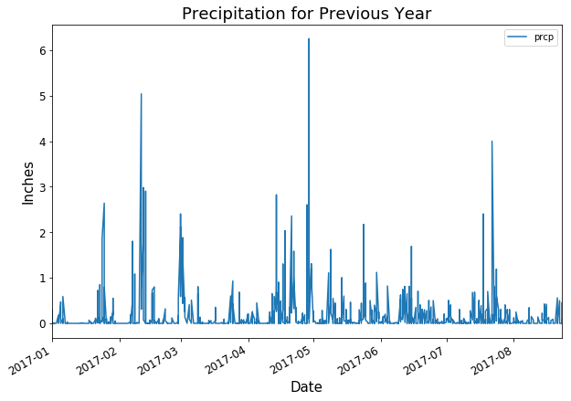
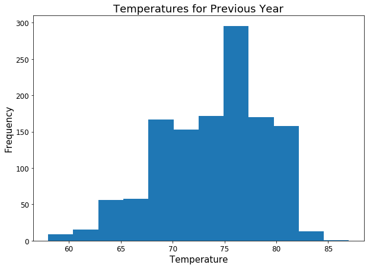
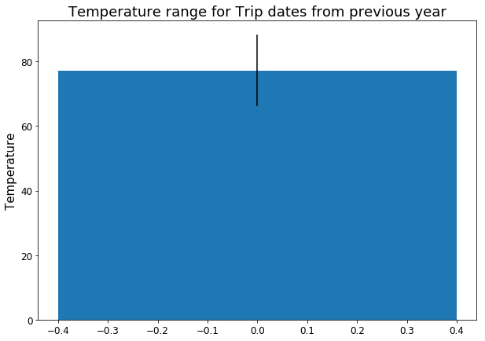

```python
# Python SQL toolkit and Object Relational Mapper
from sqlalchemy.ext.automap import automap_base
from sqlalchemy.orm import Session
from sqlalchemy import create_engine, func
import pandas as pd
import numpy as np
import matplotlib.pyplot as plt

from flask import Flask, jsonify

from datetime import datetime
from dateutil.relativedelta import relativedelta
```


```python
# Create engine using the `hawaii.sqlite` database file
engine = create_engine("sqlite:///hawaii.sqlite")
```


```python
# Declare a Base using `automap_base()`
Base = automap_base()
```


```python
# Use the Base class to reflect the database tables
Base.prepare(engine, reflect=True)
```


```python
# Print all of the classes mapped to the Base
print(Base.classes.keys())
```

    ['measurements', 'stations']


```python
# Assign the stations class to a variable called `Station`
Station = Base.classes.stations
print(list(Station.__table__.columns))

# Assign the measurements class to a variable called `Measurement`
Measurement = Base.classes.measurements
print(list(Measurement.__table__.columns))
```

    [Column('id', INTEGER(), table=<stations>, primary_key=True, nullable=False), Column('station', VARCHAR(length=255), table=<stations>), Column('name', VARCHAR(length=255), table=<stations>), Column('latitude', FLOAT(), table=<stations>), Column('longitude', FLOAT(), table=<stations>), Column('elevation', FLOAT(), table=<stations>)]
    [Column('id', INTEGER(), table=<measurements>, primary_key=True, nullable=False), Column('station', VARCHAR(length=255), table=<measurements>), Column('date', DATETIME(), table=<measurements>), Column('prcp', FLOAT(), table=<measurements>), Column('tobs', FLOAT(), table=<measurements>)]


```python
# Create a session
session = Session(engine)
```


```python
# Precipitation Analysis

# Query date and prcp from measurements for dats greater than 1/1/2017
prcp_data_df = pd.read_sql("SELECT date, prcp FROM measurements WHERE date > '2017-01-01'", engine, index_col='date')

# reformat date to %Y-%m-%d format
prcp_data_df.index = pd.to_datetime(prcp_data_df.index, format="%Y-%m-%d")

print(f'there are {len(prcp_data_df)} rows of data')
prcp_data_df.head()
```

    there are 1267 rows of data


<div>
<style>
    .dataframe thead tr:only-child th {
        text-align: right;
    }

    .dataframe thead th {
        text-align: left;
    }

    .dataframe tbody tr th {
        vertical-align: top;
    }
</style>
<table border="1" class="dataframe">
  <thead>
    <tr style="text-align: right;">
      <th></th>
      <th>prcp</th>
    </tr>
    <tr>
      <th>date</th>
      <th></th>
    </tr>
  </thead>
  <tbody>
    <tr>
      <th>2017-01-01</th>
      <td>0.0</td>
    </tr>
    <tr>
      <th>2017-01-02</th>
      <td>0.0</td>
    </tr>
    <tr>
      <th>2017-01-03</th>
      <td>0.0</td>
    </tr>
    <tr>
      <th>2017-01-04</th>
      <td>0.0</td>
    </tr>
    <tr>
      <th>2017-01-05</th>
      <td>0.0</td>
    </tr>
  </tbody>
</table>
</div>


```python
# plot dataframe
prcp_data_df.plot(figsize=(10, 7))

# change fontsize of x and y ticks
plt.xticks(fontsize=12)
plt.yticks(fontsize=12)

# add title and axis labels
plt.title('Precipitation for Previous Year', fontsize=18)
plt.xlabel('Date', fontsize=15)
plt.ylabel('Inches', fontsize=15)

plt.show()
```





```python
# print summary stats
prcp_data_df.describe()
```


<div>
<style>
    .dataframe thead tr:only-child th {
        text-align: right;
    }

    .dataframe thead th {
        text-align: left;
    }

    .dataframe tbody tr th {
        vertical-align: top;
    }
</style>
<table border="1" class="dataframe">
  <thead>
    <tr style="text-align: right;">
      <th></th>
      <th>prcp</th>
    </tr>
  </thead>
  <tbody>
    <tr>
      <th>count</th>
      <td>1267.000000</td>
    </tr>
    <tr>
      <th>mean</th>
      <td>0.165927</td>
    </tr>
    <tr>
      <th>std</th>
      <td>0.453913</td>
    </tr>
    <tr>
      <th>min</th>
      <td>0.000000</td>
    </tr>
    <tr>
      <th>25%</th>
      <td>0.000000</td>
    </tr>
    <tr>
      <th>50%</th>
      <td>0.000000</td>
    </tr>
    <tr>
      <th>75%</th>
      <td>0.105000</td>
    </tr>
    <tr>
      <th>max</th>
      <td>6.250000</td>
    </tr>
  </tbody>
</table>
</div>


```python
# Station Analysis
# Design a query to calculate the total number of stations.
total_stations = (session
                  .query(func.count(Station.name))
                  .scalar())

print(f'There are {total_stations} stations')
```

    There are 9 stations


```python
# Design a query to find the most active stations.
most_active_stations = (session
                        .query(Measurement.station, func.count(Measurement.station))
                        .group_by(Measurement.station)
                        .order_by(func.count(Measurement.station).desc())
                        .limit(3)
                        .all())

print('The 3 stations with the most activity are:\n')

highest_measurement_count = 0
most_active_station = None

for station in most_active_stations:
    
    print(f'Station Name: {station[0]}\nMeasurements: {station[1]}\n')
    
    if station[1] > highest_measurement_count:
        
        most_active_station = station[0]
        
        highest_measurement_count = station[1]
            
print(f'The most active station is {most_active_station}')                
```

    The 3 stations with the most activity are:
    
    Station Name: USC00519281
    Measurements: 2772
    
    Station Name: USC00513117
    Measurements: 2696
    
    Station Name: USC00519397
    Measurements: 2685
    
    The most active station is USC00519281


```python
# retrieve the last 12 months of temperature observation data (tobs)
tobs = (session
        .query(Measurement.tobs)
        .filter(Measurement.date > '2017-01-01'))

# create numpy array to hold tobs values
tob_values = []

for tob in tobs:
    
    tob_values.append(tob[0])

tob_values_array = np.array(tob_values)

plt.figure(figsize=(10, 7))
plt.hist(tob_values_array, bins=12)

# change fontsize of x and y ticks
plt.xticks(fontsize=12)
plt.yticks(fontsize=12)

# add title and axis labels
plt.title('Temperatures for Previous Year', fontsize=18)
plt.xlabel('Temperature', fontsize=15)
plt.ylabel('Frequency', fontsize=15)

plt.show()
```





```python
# Temperature Analysis
# function to calculate the minimum, average, and maximum temperatures for specified date range
def calc_temps(start_date, end_date):
    
    converted_start_date = datetime.strptime(start_date, '%Y-%m-%d').date()
    converted_end_date = datetime.strptime(end_date, '%Y-%m-%d').date()
    
    converted_start_date = converted_start_date - relativedelta(years=1)
    converted_end_date = converted_end_date - relativedelta(years=1)     
    
    print(f'these are the temp stats for {start_date} to {end_date} last year:')
    
    # query for min temp
    temp_min = (session
                .query(func.min(Measurement.tobs))
                .filter(Measurement.date >= converted_start_date)
                .filter(Measurement.date <= converted_end_date)
                .scalar())
    
    print(f'Min: {temp_min}')
    
    # query for max temp
    temp_max = (session
                .query(func.max(Measurement.tobs))
                .filter(Measurement.date >= converted_start_date)
                .filter(Measurement.date <= converted_end_date)
                .scalar())  
    
    print(f'Max: {temp_max}')    
    
    # query for average temp
    temp_avg = (session
                .query(func.avg(Measurement.tobs))
                .filter(Measurement.date >= converted_start_date)
                .filter(Measurement.date <= converted_end_date)
                .scalar())

    print(f'Avg: {temp_avg}')
    
    # return dictionary of temp stats
    return {'min': temp_min, 'max': temp_max, 'avg': temp_avg}
```


```python
# define trip start and trip end date
trip_start = '2018-06-02'
trip_end = '2018-06-18'

# pull stats for trips dates in the previous year
trip_stats = calc_temps(trip_start, trip_end)
```

    these are the temp stats for 2018-06-02 to 2018-06-18 last year:
    Min: 72.0
    Max: 83.0
    Avg: 77.27173913043478


```python
# plot previous year stats on bar plot
plt.figure(figsize=(10, 7))
plt.bar(0, trip_stats['avg'], yerr=(trip_stats['max']-trip_stats['min']))

# change fontsize of x and y ticks
plt.xticks(fontsize=12)
plt.yticks(fontsize=12)

# add title and axis labels
plt.title('Temperature range for Trip dates from previous year', fontsize=18)
plt.ylabel('Temperature', fontsize=15)

plt.show()
```




